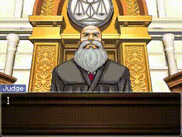

# Using the Gavel Slam Effect
When things get heated in the courtroom, you can make the Judge slam his gavel.



This document will show you how to implement this in your own scripts, both
via the `compose_gavel_slam()` convenience function as well as by hand using
`DialogueAction` objects in Python.

## Doing it quick with `compose_gavel_slam()`
Most of the time, you'll probably want the gavel slam's timing to look like
the original games. Writing out all of the `DialogueAction` commands to get
it right is a real pain. That's where the `compose_gavel_slam()` function
comes in! Simply call it with the number of slams you want, then concatenate
the returned list with the rest of your `BaseDialogueItem` objects for your
`DialoguePage`.

For example, to play a single gavel slam, you can simply call:
```py
compose_gavel_slam(num_slams=1)
```
This should be a nearly frame-for-frame recreation of a single gavel slam
from the games. The function has optional parameters `delay_between_slams`
and `finish_wait_time` which allow you to customize the amount of time between
consecutive gavel slams and the amount of time the camera lingers on the last
gavel slam, respectively.

See `example_gavel_simple.py` for examples of how to use the function.

After the gavel slam animation is complete, make sure to add a `cut` command
to move the camera somewhere else.

## Doing it yourself
On the off-chance that you want more control over the gavel slam than the
`compose_gavel_slam()` function provides, you can write your own series of
commands.

The gavel slam animation itself is controlled by the `gavel <frame>` command,
where `<frame>` is a number from `0` to `3`:
- `0` - The gavel is not visible.
- `1` - The bottom of the gavel is visible at the top of the screen.
- `2` - The entire gavel is visible and touching the block.
- `3` - The entire gavel is visible and touching the block, and there are impact
lines around the screen.

Essentially, to play an animation with the gavel, you alternate between `gavel`
commands to update the visible frame and `wait` commands to make that frame
stay on-screen for a certain amount of time.

To see this in action, let's take a look at the output of
`compose_gavel_slam(num_slams=1)`:

```py
[
    # Move the camera to the gavel slam location
    DialogueAction("hidebox", 0),
    DialogueAction("cut gavel", 0),

    # Gavel not visible for 0.3 seconds (~10 frames)
    DialogueAction("gavel 0", 0),
    DialogueAction("wait 0.3", 0),

    # Gavel barely visible for 0.04 seconds (~1 frame)
    DialogueAction("gavel 1", 0),
    DialogueAction("wait 0.04", 0),

    # Gavel on block for 0.04 seconds (~1 frame)
    DialogueAction("gavel 2", 0),
    DialogueAction("wait 0.04", 0),

    # Gavel on block with impact lines for 0.766 seconds (~23 frames)
    # Also play the "gavel slam" sound effect and shake the screen
    DialogueAction("gavel 3", 0),
    DialogueAction("sound gavel", 0),
    DialogueAction("shake 3 0.2", 0),
    DialogueAction(f"wait 0.766", 0),
]
```
You can, of course, change the timing on the animation's frames by changing
the values for the `wait` commands.

Just as with the `compose_gavel_slam()` function's output, once you're done with
the animation, make sure to use the `cut` and `showbox` commands to return the
camera to somewhere in the scene and display the dialogue box again.

The example file `example_gavel.py` demonstrates how to write `DialogueAction`
commands to do a gavel slam animation manually.