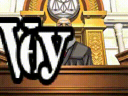

# Using the Judge Verdict Effect
In addition to the usual dialogue text boxes, *Objection* allows you to recreate
the dramatic "Guilty" and "Not Guilty" screens that appear at the end of
*Ace Attorney* cases. In fact, you can make the verdict be any text you want!

The process for setting this up correctly is a bit complex, so hopefully this
document will help you understand how to go about it. We'll make the Judge's
verdict be "Very Cool" in white letters (similar to "Not Guilty" from the
original games).



## Doing it quick with `compose_verdict()`
If you're putting together lists of `DialogueAction` objects, and don't want
to go through the hassle of setting up the individual commands correctly, you
can use the `compose_verdict()` helper function instead:
```py
from objection_engine.composers import compose_verdict

verdict_commands = compose_verdict(
    text="Very Cool",
    slam_group="word",  # can be "word" or "letter"
    color="white",      # can be "white" or "black"
    slam_delay=0.5,
    finish_wait_time=2.0
    )
```
This will generate all of the commands in order - you'll just need to
concatenate the returned list with your other `BaseDialogueItem` lists. The
`example_dmv_verdict.py`, `example_dmv_verdict_2.py`, and
`example_dmv_verdict_words.py` scripts demonstrate this.

The `slam_group` argument determines whether the letters should slam down
one at a time (`"word"`), or in groups of words (`"word"`).

The `color` argument determines whether the text should be white with a black
outline (`"white"`) or black with a white outline (`"black"`).

While much more convenient, you do lose fine control over the behavior of the
verdict text when using this function, so I'll also go over how to implement
the equivalent behavior yourself.

## Doing it yourself
### Initializing the verdict text
This step is easy - just issue a single command:
```py
DialogueAction("verdict set \"Very Cool\" white", 0)
```
If you wanted the text to be black with a white border (i.e., styled like "Guilty"
from the original games), then you'd simply change `white` to `black`.

### Making the verdict text appear
This is the hardest step, although it's not too bad. When the text is initialized
as shown above, it doesn't appear on screen. To make each individual character
appear, we have to issue the command `verdict show <i>`, where `<i>` is the 
zero-based index of the character from the verdict text to show. In our example,
the verdict text is "Very Cool", so:
* `verdict show 0` would make "V" appear
* `verdict show 1` would make "e" appear
* `verdict show 2` would make "r" appear
* `verdict show 3` would make "y" appear
* `verdict show 4` would make " " appear (aka nothing)

and so on.

These commands are non-blocking (i.e., the next command in line will execute
immediately, instead of waiting for the current letter to finish animating),
and they don't play any other effects on their own. To get things like the
dramatic pound sound effect or screen shake effect to play as the letters
slam down, we will need to add more commands.

In this case, we want to have the word "Very" slam down, then wait a brief
moment before having "Cool" slam down as well. The Python `DialogueAction`
commands for this part would look like this:

```py
[
    # Animate in the first word, "Very".
    DialogueAction("verdict show 0", 0),  # V
    DialogueAction("verdict show 1", 0),  # e
    DialogueAction("verdict show 2", 0),  # r
    DialogueAction("verdict show 3", 0),  # y
    DialogueAction("verdict show 4", 0),  # SPACE

    # Play the slam sound effect (called "guilty")
    # and shake the screen. This happens after a short delay
    # so that they line up with the letters' animations finishing.
    DialogueAction("wait 0.2", 0),
    DialogueAction("sound guilty", 0),
    DialogueAction("shake 4 0.1", 0),

    # Include a short delay between words "Very" and "Cool".
    DialogueAction("wait 0.5", 0),

    # Animate in the second word, "Cool".
    DialogueAction("verdict show 5", 0),  # C
    DialogueAction("verdict show 6", 0),  # o
    DialogueAction("verdict show 7", 0),  # o
    DialogueAction("verdict show 8", 0),  # l

    # Same effects as before but for the second word.
    DialogueAction("wait 0.2", 0),
    DialogueAction("sound guilty", 0),
    DialogueAction("shake 4 0.1", 0),

    # Let the words stay on screen for a few seconds.
    DialogueAction("wait 2.0", 0)
]
```


### Clearing the verdict text
To make the text disappear, simply issue the command `verdict clear`.

As a Python `DialogueAction` object:
```py
DialogueAction("verdict clear", 0)
```

### Putting it all together
All of the steps together would look like:
```py
[
    # Initialize the verdict text.
    DialogueAction("verdict set 'Very Cool' white", 0),

    # Animate in the first word, "Very".
    DialogueAction("verdict show 0", 0),  # V
    DialogueAction("verdict show 1", 0),  # e
    DialogueAction("verdict show 2", 0),  # r
    DialogueAction("verdict show 3", 0),  # y
    DialogueAction("verdict show 4", 0),  # SPACE

    # Play the slam sound effect (called "guilty")
    # and shake the screen. This happens after a short delay
    # so that they line up with the letters' animations finishing.
    DialogueAction("wait 0.2", 0),
    DialogueAction("sound guilty", 0),
    DialogueAction("shake 4 0.1", 0),

    # Include a short delay between words "Very" and "Cool".
    DialogueAction("wait 0.5", 0),

    # Animate in the second word, "Cool".
    DialogueAction("verdict show 5", 0),  # C
    DialogueAction("verdict show 6", 0),  # o
    DialogueAction("verdict show 7", 0),  # o
    DialogueAction("verdict show 8", 0),  # l

    # Same effects as before but for the second word.
    DialogueAction("wait 0.2", 0),
    DialogueAction("sound guilty", 0),
    DialogueAction("shake 4 0.1", 0),

    # Let the words stay on screen for a few seconds.
    DialogueAction("wait 2.0", 0),

    # Clear the verdict text.
    DialogueAction("verdict clear", 0),
]
```
See the example file `example_verdict_simple.py` for an implementation of this.