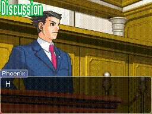

# Using the Testimony Indicator Effect
To indicate that a specific type of dialogue is playing out, you can place
a flashing text label in the top-left corner of the screen. In the original
games, this label would read "Testimony" during a witness's testimony in
court. With *Objection*, you can set this label to anything you want, as well
as change its colors as you please.



See `example_testimony_indicator.py` for example usage.

## Setting up the effect
Only a few commands are necessary to set up the label effect:
```py
[
    # Set the text for the label
    DialogueAction("testimony set 'Testimony'", 0),

    # (Optional) Set the fill color of the text.
    # The arguments following "fillcolor" are RGB values in the range 0-255.
    DialogueAction("testimony fillcolor 230 255 230", 0),

    # (Optional) Set the stroke color of the text.
    # The arguments following "strokecolor" are RGB values in the range 0-255.
    DialogueAction("testimony strokecolor 20 150 80", 0),

    # Start flashing the label
    DialogueAction("testimony show", 0)
]
```
Just add those commands to your list of `BaseDialogueItem` objects and you'll 
have your label!

### Resetting the colors
If you don't set the fill or stroke colors, they'll default to `(255, 255, 255)`
(white) and `(0, 192, 56)` (the green color used in the original games'
"Testimony" label), respectively.

If you'd like to return the colors to their defaults, you can pass a single
parameter, `default`, to `testimony fillcolor` and `testimony strokecolor`,
like so:
```py
[
    # Reset the fill color of the label to white
    DialogueAction("testimony fillcolor default", 0),

    # Reset the stroke color of the label to the green color used in the
    # original games
    DialogueAction("testimony strokecolor default", 0)
]
```

### Turning off the label
Disabling the label is as easy as issuing a single command:
```py
[
    DialogueAction("testimony hide", 0)
]
```
That's it!
