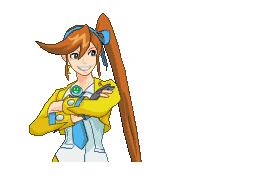
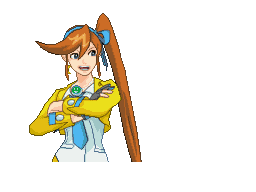

# Creating a Custom Character
*Objection 4* makes it very easy to add your own characters to the character
pool! In this tutorial, I'll go through the steps of adding Athena Cykes.

**NOTE:** You'll need access to the `assets` folder of *Objection* in order to
add custom characters. If you're using the public social media bots, this won't
work.

## Setting up the character folder
Inside of the `characters` folder, create a new folder with a name for your
character. This will be the character's ID, and the name by which other parts
of the engine will refer to them. The name can be anything that a folder/file
can be named, **with the notable exception that it must not start with an
underscore or else it will be ignored**.

For this example, I'll name the folder `athena`, giving the character that ID.

The folder will also need a `config.toml` file. Copy the file named
`config_template.toml` from the `characters` folder into your new folder, and
rename it to `config.toml`. For now, we'll leave it be at that.

## Getting the sprites
This is probably the hardest part. Sprites will need to be **animated GIFs**
with a size of **256x192**. See http://www.court-records.net/sprites1.htm
(the source of the sprites that *Objection* uses by default) as a reference.

I'll use the set of amazing Athena Cykes sprites created by Rajin, SuperAj3, ShiroForever, Hesseldahl, and SilverGlas, which can be found here: https://imgur.com/a/tyUEF

First, copy the GIFs that you want to use as character sprites into the
character folder. A complete character animation should consist of at least
two GIFs:
- `{character}-{animation}-talk.gif` plays while the character is speaking
- `{character}-{animation}-idle.gif` plays once the character finishes speaking

where `{character}` is the character's ID (i.e. the same as the folder), and
`{animation}` is the name of the animation (can be anything as long as it makes
for a valid filename).

I'll name the below sprite `athena-confident-idle.gif`:




And the below sprite will be `athena-confident-talk.gif`:



## Adding custom voice clips
If you've got "Objection!", "Hold it!", or "Take that!" voice clips for your
character, name them `objection.wav`, `holdit.wav`, and `takethat.wav` (`.mp3`
is also allowed), and drop them into the character folder. Now when one of those
bubbles appears from that character, their voice will be used instead of the
"generic" sound effect!

## Setting up `config.toml`
The hardest part is over now! Open up the `config.toml` file inside your
character folder. There are just a few fields in here we need to fill out:
- **`display_name`** should be the name of the character as it would appear
in a text box from the actual game. I'll enter it as `"Athena"` here.
- **`location`** should be the position in the courtroom where the character
appears. Since these sprites are designed for Athena to be positioned at the
defense bench, I'll set this to `"left"`. (For a complete list of valid
locations, see
[the "Valid positions" section of DialogueAction Commands](DialogueActionCommands.md#valid-positions)).
- **`gender`** should be the gender of the character. It's used to determine
what kind of voice "blips" should be used. For Athena, I'll make this `"female"`.


Underneath the line `[sprites]`, we have arrays that hold the names of animations
that should be played for the corresponding sentence polarities. Using the
example of the "confident" animation above, since Athena is happy there, it might
make sense to add that animation to the `positive` array.

Now all you have to do is add the rest of the animation names! It's OK to have
one animation be a part of multiple arrays.

Here's the finished `config.toml` file I ended up with after naming all of the
animations and classifying them:
```toml
display_name = "Athena"
location = "left"
gender = "female"

[sprites]
neutral = ["normal", "screen", "thinking"]
positive = ["confident", "happy", "pumped"]
negative = ["defeated", "deskslam", "objection", "shaking"]
```

## The final product
After everything is done, the `athena` folder looks like this:
```
athena
├ athena-confident-idle.gif
├ athena-confident-talk.gif
├ athena-defeated-idle.gif
├ athena-defeated-talk.gif
├ athena-deskslam-idle.gif
├ athena-deskslam-talk.gif
├ athena-happy-idle.gif
├ athena-happy-talk.gif
├ athena-normal-idle.gif
├ athena-normal-talk.gif
├ athena-objection-idle.gif
├ athena-objection-talk.gif
├ athena-pumped-idle.gif
├ athena-pumped-talk.gif
├ athena-screen-idle.gif
├ athena-screen-talk.gif
├ athena-shaking-idle.gif
├ athena-shaking-talk.gif
├ athena-thinking-idle.gif
├ athena-thinking-talk.gif
├ config.toml
├ holdit.wav
├ objection.wav
└ takethat.wav
```

With the following script, we can generate a video of Athena in action:
```python
from objection_engine.v4.make_movie import render_comment_list
from objection_engine.beans.comment import Comment

comments = [
    Comment(
        user_name="Athena",
        text_content="Hey, it's me, Athena Cykes! How are you doing?",
    ),
    Comment(
        user_name="Athena",
        text_content="I'm totally ready to say a whole lot of text!" \
                     " Bad sad uh oh bad sentence so now I am sad.",
    ),
]
render_comment_list(comments, assigned_characters={"Athena": "athena"})
```

